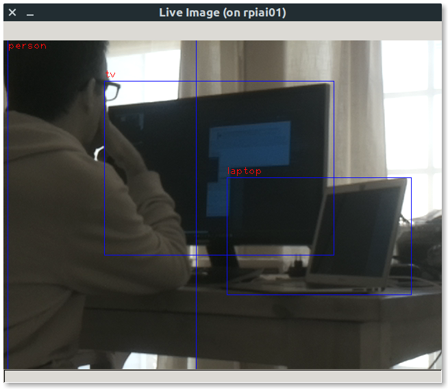

### Object detection for the RaspberryPi with OpenCV




This code is based on the code from: https://github.com/opencv/opencv/wiki/TensorFlow-Object-Detection-API.

It uses the Raspberry Pi Camera Module (make sure to enable the camera via `raspi-config` - if you have not already done so)

The first time download config and model: "MobileNet-SSD v2"  Version "2018_03_29"
from https://github.com/opencv/opencv/wiki/TensorFlow-Object-Detection-API
and copy to the `models` sub directory. Then untar/unpack the model file so you end up with the
files like this:

`models/ssd_mobilenet_v2_coco_2018_03_29/frozen_inference_graph.pb`

and

`models/ssd_mobilenet_v2_coco_2018_03_29.pbtxt`


### Required modules and raspbian packages 

To install OpenCV on the Raspberry Pi install:

Install virtual environment and setup an environment for our application 
```bash 
sudo apt update 
sudo apt install python3-venv 
python3.5 -m venv py35opencv
```

Activate the newly created virtual environment 
```bash 
source py35opencv/bin/activate
```

Install raspbian packages required for OpenCV to run and python module for camera and opencv

```bash 
sudo apt install libilmbase-dev libopenexr-dev libgstreamer1.0-dev sudo apt install libavcodec-dev libavformat-dev libswscale-dev libv4l-dev 
sudo apt install libcblas-dev libhdf5-dev libhdf5-serial-dev libatlas-base-dev libjasper-dev libqtgui4 libqt4-test
pip install "picamera[array]" 
pip install opencv-python 
```

Now run the code (while in the py35opencv virtual environment):
```bash
python ocvdetect.py
```

